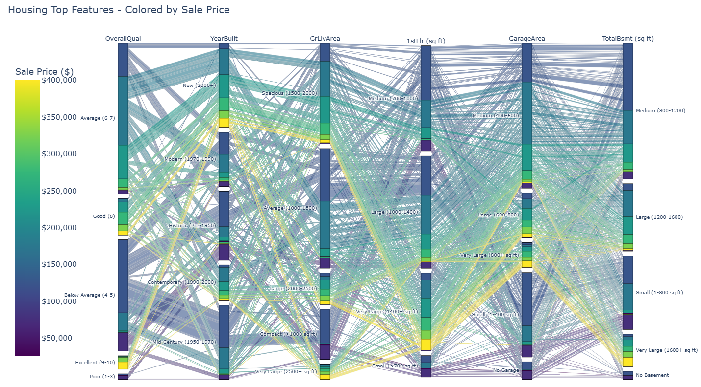

# 

# House Price Predictor

A machine learning web application that predicts house sale prices, based on several of its measured attributes. This project helps a friend/client (Lydia Doe) maximize the sale value of four inherited properties, in Ames - Iowa, by understanding price drivers in the given housing market. The application then, generalizes the predictive model for any house.

## Dataset Content

* Dataset is sourced from [Kaggle](https://www.kaggle.com/codeinstitute/housing-prices-data). 
* The dataset has almost 1.5 thousand rows and represents housing records from Ames, Iowa, indicating house profile (Floor Area, Basement, Garage, Kitchen, Lot, Porch, Wood Deck, Year Built) and its respective sale price for houses built between 1872 and 2010.

|Variable|Meaning|Units|
|:----|:----|:----|
|1stFlrSF|First Floor square feet|334 - 4692|
|2ndFlrSF|Second-floor square feet|0 - 2065|
|BedroomAbvGr|Bedrooms above grade (does NOT include basement bedrooms)|0 - 8|
|BsmtExposure|Refers to walkout or garden level walls|Gd: Good Exposure; Av: Average Exposure; Mn: Minimum Exposure; No: No Exposure; None: No Basement|
|BsmtFinType1|Rating of basement finished area|GLQ: Good Living Quarters; ALQ: Average Living Quarters; BLQ: Below Average Living Quarters; Rec: Average Rec Room; LwQ: Low Quality; Unf: Unfinshed; None: No Basement|
|BsmtFinSF1|Type 1 finished square feet|0 - 5644|
|BsmtUnfSF|Unfinished square feet of basement area|0 - 2336|
|TotalBsmtSF|Total square feet of basement area|0 - 6110|
|GarageArea|Size of garage in square feet|0 - 1418|
|GarageFinish|Interior finish of the garage|Fin: Finished; RFn: Rough Finished; Unf: Unfinished; None: No Garage|
|GarageYrBlt|Year garage was built|1900 - 2010|
|GrLivArea|Above grade (ground) living area square feet|334 - 5642|
|KitchenQual|Kitchen quality|Ex: Excellent; Gd: Good; TA: Typical/Average; Fa: Fair; Po: Poor|
|LotArea| Lot size in square feet|1300 - 215245|
|LotFrontage| Linear feet of street connected to property|21 - 313|
|MasVnrArea|Masonry veneer area in square feet|0 - 1600|
|EnclosedPorch|Enclosed porch area in square feet|0 - 286|
|OpenPorchSF|Open porch area in square feet|0 - 547|
|OverallCond|Rates the overall condition of the house|10: Very Excellent; 9: Excellent; 8: Very Good; 7: Good; 6: Above Average; 5: Average; 4: Below Average; 3: Fair; 2: Poor; 1: Very Poor|
|OverallQual|Rates the overall material and finish of the house|10: Very Excellent; 9: Excellent; 8: Very Good; 7: Good; 6: Above Average; 5: Average; 4: Below Average; 3: Fair; 2: Poor; 1: Very Poor|
|WoodDeckSF|Wood deck area in square feet|0 - 736|
|YearBuilt|Original construction date|1872 - 2010|
|YearRemodAdd|Remodel date (same as construction date if no remodelling or additions)|1950 - 2010|
|SalePrice|Sale Price|34900 - 755000|

## Business Requirements

As a good friend, you are requested by your Belgian friend, Lydia Doe, who has received an inheritance from a deceased great-grandfather located in Ames, Iowa, to  help in maximising the sales price for the inherited properties.

Although your friend has an excellent understanding of property prices in her own area, she fears that basing her estimates for property worth on her current knowledge might lead to inaccurate appraisals. What makes a house desirable and valuable where she comes from might not be the same in Ames, Iowa. She found a public dataset with house prices for Ames, Iowa, and will provide you with that.

* 1 - The client is interested in discovering how the house attributes correlate with the sale price. Therefore, the client expects data visualisations of the correlated variables against the sale price to show that.
* 2 - The client is interested in predicting the house sale price from her four inherited houses and any other house in Ames, Iowa.

## Hypothesis and how to validate?

### Hypothesis 1: House Size and Price Correlation
**Hypothesis:** Larger houses drive higher sale prices.

**Validation:**
* Spearman and Pearson correlation analysis to measure the strength of relationship
* Scatter plots showing the relationship between square footage and sale price
* Parallel plot visualization to show how size categories relate to price ranges

**Result:** Validated - GrLivArea (living area) shows strong positive correlation (>0.70) with sale price

### Hypothesis 2: Quality Ratings Impact Price
**Hypothesis:** Houses with higher overall quality ratings have higher sale prices.

**Validation:**
* Correlation analysis between OverallQual and SalePrice
* Visualization of price distributions across different quality ratings
* Feature importance analysis from the ML model

**Result:** Validated - OverallQual is the most important feature with the strongest correlation to price

### Hypothesis 3: Year Built Affects Price
**Hypothesis:** Newer houses generally sell for higher prices than older properties.

**Validation:**
* Correlation analysis between YearBuilt and SalePrice
* Categorical analysis showing price trends across different construction periods
* Inclusion in top features identified by the ML model

**Result:** Validated - YearBuilt shows positive correlation and appears in top 5 important features

## The rationale to map the business requirements to the Data Visualisations and ML tasks

### Business Requirement 1: Correlation Analysis
**Requirement:** Discover how house attributes correlate with sale price

**Data Visualizations:**
* **Correlation Heatmap** - Shows the strength of relationships between features and sale price
* **Correlation Bar Chart** - Top correlated features ranked by importance
* **Parallel Plot** - Interactive visualization showing how multiple features interact to influence price
* **Sale Price Distribution** - Histogram and box plot to understand price ranges in the market

**Rationale:** These visualizations directly address Lydias's need to understand which house attributes drive prices, enabling informed decisions about which features to highlight when selling the inherited properties.

### Business Requirement 2: Price Prediction
**Requirement:** Predict sale prices for the four inherited houses and any other house in Ames, Iowa

**ML Task:** Regression Model
* **Algorithm:** ExtraTreesRegressor (selected after comparing 7 different algorithms)
* **Features:** 24 house attributes including size, quality, year built, and amenities
* **Pipeline:** Includes data cleaning, feature encoding, feature selection, and scaling
* **Performance Target:** R2 score > 0.80 on test set

**Visualizations:**
* **Actual vs Predicted Scatter Plots** - Model accuracy plotted on train and test datasets
* **Feature Importance Chart** - Identifies which features the model relies on most
* **Price Distribution Comparison** - Shows predicted prices in context of market distribution

**Rationale:** A regression model is the appropriate ML task for predicting continuous numerical values (house prices). The visualizations help validate model performance and build client confidence in the predictions.

## ML Business Case

### Predict House Sale Prices in Ames, Iowa

#### Business Objective
Lydia Doe, our client/friend, has inherited four houses in Ames, Iowa, and needs to maximize their sale value. While she understands her local Belgian real estate market, she requires accurate price predictions for the Ames market to make informed selling decisions.

#### Model Type
* **Supervised Learning** - Regression Model
* We have historical data with known sale prices (target variable)
* Goal is to predict continuous numerical values (house prices)

#### Model Success Metrics
* **R2 Score ≥ 0.80** on test set
* Predictions should be within a reasonable error margin of actual market values
* Model should generalize well to unseen data (the inherited houses)

#### Model Output
* Predicted sale price for any house in Ames, Iowa
* Feature importance rankings to understand price drivers
* Confidence metrics (R2, MAE, RMSE) to assess prediction reliability

#### Training Data
* **Source:** Kaggle Housing Prices Dataset (Ames, Iowa)
* **Size:** ~1,460 house records
* **Time Period:** Houses built between 1872-2010
* **Features:** 24 attributes including square footage, quality ratings, year built, garage/basement specs
* **Target:** SalePrice ($34,900 - $755,000)

#### Heuristics
Before ML, the client could only estimate prices based on:
* Belgian market knowledge (not applicable to Ames, Iowa)
* Simple price per square foot calculations
* Generic online estimation tools

These approaches lack local market nuance and feature-specific insights.

#### Model Performance
* **Train Set R2:** 0.918 (excellent fit, no significant overfitting)
* **Test Set R2:** 0.807 (exceeds 0.80 target, good generalization)
* **Test Set MAE:** $17,734 (average prediction error)
* **Test Set RMSE:** $27,845 (typical prediction deviation)

The model significantly outperforms heuristic approaches by capturing complex feature interactions.

## Dashboard Design

The dashboard is implemented using Streamlit and consists of 5 pages:

### Page 1: Quick Project Summary
**Purpose:** Introduce the project and business objectives

**Content:**
* Project situation and background
* Business objectives listed clearly:
1. Understand how house attributes correlate with sale prices
2. Predict accurate sale prices for four inherited properties
3. Simulate prices for any house
* Dataset overview (source, size, features)

**Widgets:** Information box displaying the project summary

---

### Page 2: Data Exploration and Correlation Study
**Purpose:** Answer Business Requirement 1 - visualize correlations between house attributes and sale price

**Content:**
* **Dataset Inspection:**
  - Dataset shape and column names
  - First rows preview
  - Basic statistics
* **Sale Price Distribution:**
  - Histogram showing price frequency
  - Box plot highlighting outliers
  - Statistics: mean, median, std dev, min, max
* **Correlation Analysis:**
  - Top Spearman correlations with SalePrice
  - Top Pearson correlations with SalePrice
  - List of top features selected for study
  - Correlation heatmap of selected features
  - Bar chart of correlations (color-coded positive/negative)
  - Interactive parallel plot showing feature categories vs price ranges

**Widgets:**
* Checkboxes to show/hide different visualizations
* Matplotlib plots (histograms, box plots, heatmaps, bar charts)
* Plotly parallel categories plot (interactive)

---

### Page 3: ML Model Description
**Purpose:** Explain the machine learning model development and performance

**Content:**
* **Model Training Details:**
  - Data preparation steps (missing value handling, train-test split)
  - Algorithm comparison table (7 algorithms tested)
  - Best algorithm: ExtraTreesRegressor (R2 = 0.801)
  - Hyperparameter tuning results
  - Best hyperparameters: n_estimators=300, max_depth=10
* **Model Performance:**
  - Train set metrics (R2, MAE, MSE, RMSE)
  - Test set metrics (R2, MAE, MSE, RMSE)
  - Actual vs Predicted scatter plots for train and test sets
* **Feature Importance:**
  - Table showing top features ranked by importance
  - Bar chart of feature importance scores

**Widgets:**
* Checkboxes to show/hide different sections
* Dataframes displaying results
* Matplotlib scatter plots and bar charts

---

### Page 4: Inherited Houses Price Prediction
**Purpose:** Answer Business Requirement 2 - predict prices for the 4 inherited houses

**Content:**
* Display of the 4 inherited houses' attributes
* Predicted prices for each house
* Price distribution plot comparing:
  - All houses in dataset (histogram)
  - Dataset median and mean (vertical lines)
  - Each inherited house prediction (color-coded vertical lines)
* Comparison table showing:
  - Each house's predicted price
  - Percentage difference from median
  - Percentage difference from mean
* Total sum of all four houses
* Final appraisal highlighted in success box

**Widgets:**
* Checkbox to trigger predictions
* Dataframe showing inherited houses
* Matplotlib plot with multiple elements
* Metrics displaying dataset median/mean
* Color-coded table with 4 columns
* Success message box with total appraisal

---

### Page 5: Generalized Price Predictor
**Purpose:** Answer Business Requirement 2 - predict price for any house in Ames, Iowa

**Content:**
* Input controls for the 5 most important features:
1. OverallQual (slider: 1-10)
2. GrLivArea (number input: square feet)
3. YearBuilt (number input: year)
4. TotalBsmtSF (number input: square feet)
5. GarageArea (number input: square feet)
* Predicted sale price display
* Price distribution comparison plot showing:
  - All houses in dataset (histogram)
  - Dataset median and mean
  - Predicted house price
* Market comparison metrics (mean, median, % difference)
* Percentile ranking of predicted house

**Widgets:**
* Slider (OverallQual)
* Number inputs (4 features)
* Checkbox to trigger prediction
* Success box displaying predicted price
* Matplotlib plot
* Metrics showing market comparisons
* Info box showing percentile ranking

## Unfixed Bugs

No known unfixed bugs at the time of deployment. All major issues encountered during development were resolved:

* **Issue:** Paralel Plot chart has high definition on Notebook but it is blurred on Streamlit

  * **Fix:** Tried several different plotting settings without success

**Known Limitations:**
* Last year of the dataset is 2010, newer houses values  might not be well represented
* outliers - Price histogram right tail represent higher priced houses, which might have other pricing rationale, not suitable to be apraised by the model

## Deployment

### Heroku

* The App live link is: <https://ci-p5-house-pricing-f0f51362bb14.herokuapp.com/>
* Set the .python-version Python version to a [Heroku-24](https://devcenter.heroku.com/articles/python-support#supported-runtimes) stack currently supported version.
* The project was deployed to Heroku using the following steps.

1. Log in to Heroku and create an App
2. At the Deploy tab, select GitHub as the deployment method.
3. Select your repository name and click Search. Once it is found, click Connect.
4. Select the branch you want to deploy, then click Deploy Branch.
5. The deployment process should happen smoothly if all deployment files are fully functional. Click the button Open App on the top of the page to access your App.
6. If the slug size is too large then add large files not required for the app to the .slugignore file.

## Main Data Analysis and Machine Learning Libraries

### Core Data Analysis
* **NumPy (1.26.1)** - Numerical operations and array handling
  * Example: `np.inf` for price discretization/categorization boundaries in parallel plot
  * Example: Missing value handling with median calculations

* **Pandas (2.1.1)** - Data manipulation and analysis
  * Example: Loading datasets with `pd.read_csv()`
  * Example: DataFrame operations for data cleaning and exploration
  * Example: Correlation analysis with `.corr()` method

### Visualization
* **Matplotlib (3.8.0)** - Plots and visualizations
  * Example: Histograms for price distribution analysis
  * Example: Scatter plots for actual vs predicted comparisons
  * Example: Bar charts for feature importance visualization

* **Seaborn (0.13.2)** - Statistical data visualization
  * Example: Correlation heatmaps with annotations
  * Example: Enhanced scatter plots with regression lines
  * Example: Styling with `sns.set_style('whitegrid')`

* **Plotly (5.17.0)** - Interactive visualizations
  * Example: Parallel categories plot showing multi-feature relationships
  * Example: Interactive price distribution exploration

### Machine Learning
* **Scikit-learn (1.3.1)** - Core ML algorithms and utilities
  * Example: `train_test_split()` for data splitting
  * Example: `ExtraTreesRegressor` as the best calibrated model
  * Example: Model evaluation metrics (R2, MAE, MSE, RMSE)
  * Example: `StandardScaler` for feature normalization
  * Example: `SelectFromModel` for feature selection

* **Feature-Engine (1.6.1)** - Feature engineering transformations
  * Example: `OrdinalEncoder` for categorical variable encoding
  * Example: `SmartCorrelatedSelection` to remove highly correlated features
  * Example: `ArbitraryDiscretiser` for binning continuous variables in visualizations

* **XGBoost (1.7.6)** - Gradient boosting algorithm (tested but not selected)
  * Example: Compared against ExtraTreesRegressor in model selection phase

* **Imbalanced-learn (0.11.0)** - Handling imbalanced datasets
  * Example: Available for potential oversampling/undersampling if needed

### Web Application
* **Streamlit (1.40.2)** - Interactive web dashboard framework
  * Example: `st.write()` for content display
  * Example: `st.checkbox()` for interactive controls
  * Example: `st.dataframe()` for table displays
  * Example: `st.pyplot()` for matplotlib figure rendering
  * Example: `st.slider()` and `st.number_input()` for user inputs
  * Example: `st.success()` and `st.info()` for highlighted messages

### Model Persistence
* **Pickle** - Model serialization and loading
  * Example: Saving trained pipeline with `pickle.dump()`
  * Example: Loading model for predictions with `pickle.load()`

## Credits

### Content

* Dataset sourced from [Kaggle - Housing Prices Dataset](https://www.kaggle.com/codeinstitute/housing-prices-data)
* Project template and structure from [Code Institute - Heritage Housing Issues](https://github.com/Code-Institute-Solutions/milestone-project-heritage-housing-issues)
* Project reference / inspiration from [Code Institute - Churnometer](https://github.com/Code-Institute-Solutions/churnometer)
* Parallel plot implementation inspired by Code Institute Churnometer and enhanced with [Claude](https://claude.ai) assistance

### Media

* Image attached is of the own project

## Acknowledgements

* Code Institute Team for providing the project template, learning materials and Project support
* Kaggle and the dataset creators for providing the housing data
* Troubleshooting performed with [Anthropic's Claude](https://claude.ai) Assistance

